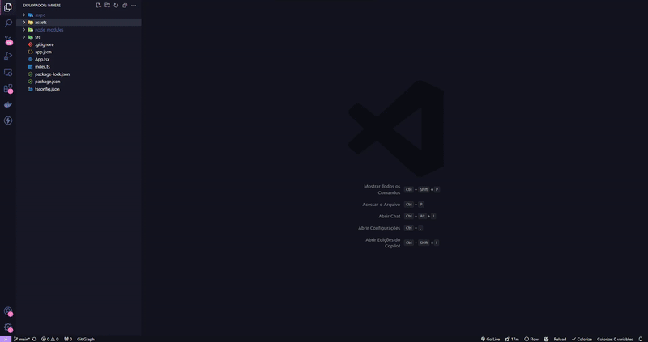

# Project ImHere

 ✓ Working With Hooks!  
 ✓ Working With Components!  
 ✓ Working With State!  
 ✓ Working With Expo Native!  
 ✓ Working With Function!  
 ✓ Working With Objects!  

 <h6 align="center">
    <h3>Aplicação</h3>
    
     
    Ferramentas usadas: React Native / Expo / Javascript
 </h6>
 <h2></h2>

 <h6 align="center">
    <h3>Código</h3>
    
     
 </h6>
 <h2></h2>